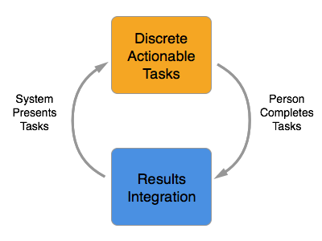
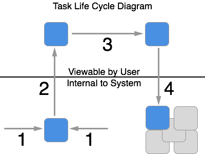
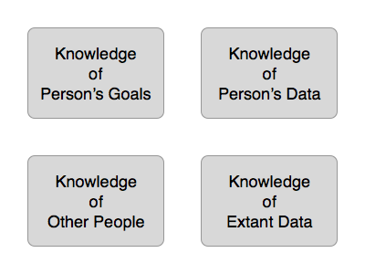

# Anticipatory Genealogy

## Introduction

Let's face it, doing family history sucks until you are an experienced genealogist. Newcomers are presented with a dizzying set of options, a wall of jargon, and a mountain of principles, resources, and methodologies to master before they can feel productive. And attaining that mastery takes time and persistence, mistakes and practice. This makes genealogy unforgiving and uninviting to all but the most dedicated of learners.

And what about you? What if you have no desire to become an experienced genealogist? What if you just want to learn a little about your grandfather? What if you are a history buff that wants to learn about history in the context of your ancestors? What if you're just interested in exploring your past and helping out where you can? What then?

Until now you have been forced to choose. To decide what you want up front. To seek out what you need. To adapt yourself to the software you chose. You had to reach out, learn, and explore all on your own.

It is time for something different. Something that learns what you want. Something that grows with you. Something that instructs, adapts, and changes based on what you do and say. Something that anticipates you.

This is what anticipatory genealogy is all about. It asks what you want to do. It guides you while you do it. It learns from you as you do it. It knows what you want, goes out and gets it, and brings it to you. It presents genealogy to you in the way you understand, knowing the goals you have in mind.

These goals vary from person to person. Let's meet a few of these people...

## Let's Meet Some People

First there is Bob. He is a 30 year old male that is comfortable with computers, is a bit of a history buff, and loves learning about his ancestors in the context of history. He doesn't much care for expanding his tree, but loves to get distracted reading about what his ancestors experienced.

And then there is Sue. She is a puzzle master, and does the daily crossword. She is 38, is married with 2 children, and is hooked on matching families with records. Give her a daily feed of discrete, bite sized relationship puzzles and she's as happy as a clam. If they are about her own family that's a bonus, but it's more about the puzzle than the person.

Now take Sally. She is the quintessential genealogist. Semi-retired at age 54, she is an experienced amateur contemplating certification. She has more notes that you can shake a stick at, and loves compiling formal genealogies about her own family. She attends every conference she can, and is learning to read Latin.

And finally Bill. He is 16 and owns a smart phone but not a computer. He is curious about his grandparents, and would like to find his great grand-parents, but doesn't quite know where to start. He doesn't want to devote the hours-at-a-time it would take to dig in and learn, so he asks for guidance and help to both do and learn genealogy.

Sally, Bill, Sue, and Bob all have different backgrounds and want different things. They have varying levels of comfort with computers/technology, and their experience with genealogy and family history is all over the charts. Let's take a look at what anticipatory genealogy might look like for each of them...

Sally logs onto her computer and is presented with the list of projects she is working on, with a notification saying she has 2 messages. She opens the first, and reads that Tom, a researcher she was working with, has added some information to his tree supporting the death date and place of an ancestor that they have in common. She glances at the notes and citations, and pulls that information into her tree with a quick button click. The next message is a note from Bess. She found some information that seems to conflict with what Sally has in her tree, and wants to discuss possibilities. Sally pulls up her tree and looks at the conflict in context with both the new and old information, and notices an alert telling her that there is another discussion happening about the same piece of information. Someone must have found a high possibility conflict and brought it to the attention of those who shared the same ancestor. After adding her two-cents and "watching" the conversation, she returns to her home screen. There she sees that the system found another non-indexed record set that may shed some light on one of her projects. She pulls up that project and takes a look at her task list. 5 of 7 record sets searched. Yesterday there were only 6. Time to dive in and research, and she does...

Bill sits down for a break between his classes and pulls out his phone. There is a notification reminding him about his daily goal to do genealogy, and he clicks it. Today's task is figuring out if two people on two different census's 10 years apart are one and the same. High, medium, and low probability are the possible answers for this one. The names are the same, as are the birth countries, but the birth years are way off. As he learned to do yesterday, he pulls up the family comparison and sees that all but one family member matches. The oldest daughter is not on the latter census. He notices that she was 14 on the last census, and it would make sense that she would be gone 10 years latter. He selects "high probability", knowing that this will feed into the pool of available matches for others to verify and eventually use. Checking his watch to make sure he has time for another, he starts reading. The names are spelled different, but sound the same...

Sue pulls out her tablet and opens up her current person-place puzzle. She has about 10 minutes before her youngest gets done with dance practice. "Good. 32/70 complete. Hmm. Anne born to John and Mary Smith. Elizabeth born to John and Mary Smith. Looks like just under 2 years apart, an easy one. Hyrum born to John and Anne Smith, but no other children for that couple. And a death of Anne Smith just after. And a Hyrum Smith. Oh, how sad. It's wondering if it's the same John Smith? Let me just check the timeline. Only two John Smith's in total, and there is a few years between John/Anne and John/Mary. High Probability. And his new wife named the first daughter after his old wife. How touching..."

Bob leans back from his computer and stretches. Lunch break. He pulls out a muffin and cracks open his salad. "Oh good, grilled chicken. And she added avocados. Mmmmm." He logs on and selects Continue Reading.
> Your grandfather also fought in the Battle of Clervaux as a member of the American 110th Regiment on 16 December 1944 – 18 December 1944 in Clervaux, northern Luxembourg. From Wikipedia: German forces of the Fifth Panzer Army under Hasso von Manteuffel's command, primarily from the 2nd Panzer Division...

"Hmm. Hasso von Manteuffel. Sounds familiar. Oh look, Bastogne. That's where I remember him from. Hey Joe! Come and take a look at this..."

Each person is doing genealogy in a way completely unique to their goals and backgrounds. The system has learned what they like to do and what they want to do, and is presenting that to each of them. Each person is learning, having fun, and making a difference.

And each person is helping the others in some way. Bill's learning and Sue's puzzles feed Sally's research, which allows Bob to enjoy learning about his relatives in the context of history. Each Person, with their own unique want and desire, contributes to the whole, and all benefit. All because each person's experience was tailored to their wants and adapted to their needs. And the more it learned about them and their ancestors, the more it is able to provide. Each new piece of information builds on the one prior, and each person provides more detail and information to draw from.

Know that we know a little about what Anticipatory Genealogy looks like, let's learn more about how it works...

## How it Works

The core of Anticipatory Genealogy is built on the interplay between two major concepts: Discrete Actionable Tasks and Results Integration.

A Person is presented with a list of Discrete Actionable Tasks. In the beginning these may be more interrogative in nature, like asking the Person what they are interested in doing, or requesting basic profile information. Then, after each Task is completed, the result of that Task is integrated into what the system knows about the Person. With each Task that is integrated, the available Tasks become more specific to the Person, suggesting Tasks like research guidance, history lessons, or logic puzzles.

First, let's look at Discrete Actionable Tasks in more depth...

### Discrete Actionable Tasks

Discrete Actionable Tasks are exactly what they sound like. A Task is a piece of work to be done or undertaken, and in this case is specific to furthering a Person's genealogy goals. Each Task is discrete, meaning individually separate and distinct. Each task is bounded and well defined, and there is a clear and obvious end result. Each Task is also actionable, meaning that the Task is able to be done or acted on; having practical value. What needs to be done to complete the task is obvious and possible given the current state of the system, and that action has an actual value to the system and the person.

Tasks may be created in one of three ways: through results integration, by the completion of another task, or by the explicit request of the Person. The creation of tasks by results integration will be covered in the next section. The creation of a task via the completion of another task is best explained by example. Say that you are looking for evidence of a Birth. The System knows that there are two record sets to search, A and B, but you should only search B if A has no results. So a Task to search B would be created on the completion of the Task to search record set A results in the birth not being found. The creation of a Task by explicit Person request is like when a Person manually adds a task to a research Log. These tasks are still added to and integrated into the system, but they were not generated by the system.

**A Note about ambiguous Tasks**

One of the most annoying types of tasks to get is "Do X" with no specific guidelines as to how to complete the task. Example is find x person with no specific how-tos. This type of task is specifically disallowed by definition, as it is not actionable. There is no specific instruction that the Person can complete to satisfy this task. A grouping of tasks may have this overall goal, but don't make this a task please :)

**The lifecycle of a Task is as follows:**

1. The Task is created.
2. The Task is made available to the Person.
3. The Task is completed.
4. The Task's result is integrated into the system.

**Task Components: A Task must contain at least the following:**

* Description of the task
* State of the task (Done/Not Done)
* Result of the task

**A Note About State**

Note no intermediate state/working. That is not allowed. Done or not. "In progress" is not handled by this system, but can be inferred by looking at a task series/tree as a whole. NOT in individual tasks.

**Task Organization**

May times it is useful to organize tasks into series, lists, trees, or other groupings to provide tracking details and other analysis capabilities.

The actual grouping is taken into account by the results integration step and will generate new tasks based off of the rules of the grouping. Discuss this more in Results Integration.

* Series - Steps that must be completed in order
* Tree - Mutually Exclusive Tasks based on previous choices
* List - Steps to be completed in any order
* Group - Mash-up of above stuffs?

**Types of Tasks**

* Research Tasks
* Reading/Learning about Ancestor Tasks
* Learning how to do Genealogy Tasks
* Puzzle Tasks
* Direct Query Tasks (teach the System what you want, IE I want to do research on X line)

**Task Rejection**

There is an important case to consider when thinking about task completion: rejection. What happens when a Person actively rejects a task. When they tell us that they have no interest in completing that particular task and dismiss it. This counts as a task completion and the state of the task is complete, but the result of the task is that the Person rejected it. This information is taken into account by the Results Integration step to suggest (or not) additional tasks for the Person to perform.

### Results Integration

The other major component of Anticipatory Genealogy is Results Integration. Again, fairly straightforward when you say it. It means that every task that has been completed is taken into account when providing additional tasks for the person to complete. But this information is not enough by itself. It must be combined with two other sources of information, tasks completed by other people and data/information available to the person.

**Knowledge of Person's Goals**

Information about the person is primarily obtained by the completion of Tasks. Some of these tasks may be direct queries, like are you interested in learning about history in the context of your genealogy. Others are derived from tasks that have been completed already, such as they completed the research on ancestor X from country Y, and there is some additional work to do for another ancestor in the same country. All of the completed and outstanding tasks are saved and taken into account when surfacing new tasks. 

**Knowledge of Person's Data**

This is the Person's genealogical data. It contains their family tree, sources, notes, research logs, and any other information entered by the Person that is used in a genealogical process. This may be data contained within the system or data that resides outside. This information is taken into account to add context to history or to search for tasks to complete that further the Person's goals in researching and/or expanding their tree.

**Knowledge of Other People**

The system takes into account what others have done in similar circumstances to provide accurate and useful tasks to the person. Knowing that people who like X also enjoy completing y is relevant and useful. This information can be obtained by examining other Person's task lists using machine learning and other techniques. It can also be used to suggest collaboration opportunities and other interest overlaps to the person.

**Knowledge of Extant Data**

This is a knowledge of what data exists that can be leveraged and utilized both by and on behalf of the Person. It includes things like what records are extant for a particular location and time, what data is available to explain events, times, and historical contexts to people, etc. It is the knowledge of information that can be shown to the Person or searched by the Person to further their goals.

**Process of Results Integration**

Just knowing about people and data does us no good unless we analyze that knowledge, draw conclusions and inferences, and use that information to benefit the Person. So we take the information we have and generate a set of Tasks that we feel best suites the Person at this time. We look at what we know about the Person, what other Persons like him/her have done, and the data that is available to use and present the Person with the set of tasks we think they would like best.

### Anticipatory Genealogy

Now that we know a bit more about the two main concepts of Anticipatory Genealogy, lets look at how they work together using some examples.

**Primary Research**

**Collaboration??**

**Learning About Research**

**Person-Place Puzzles**

**Ancestors in History**
