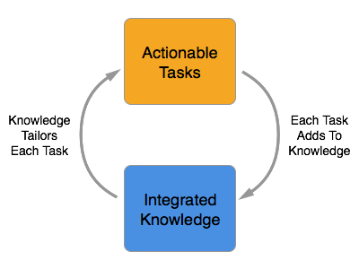

# Anticipatory Genealogy

Giving each person a rich and fulfilling genealogy experience by offering them what they want, when they need it, presenting it in the way they understand, completely unique and personalized to them.

## Introduction

Let's face it, traditional family history sucks until you are an experienced genealogist. Newcomers are presented with a dizzying array of choices, a wall of jargon, and a mountain of principles, resources, and methodologies to master before they can feel productive. This creates an unforgiving and uninviting genealogy experience to all but the most dedicated of learners.

And what about you? What if you have no desire to become an experienced genealogist? What if you just want to explore your past and help out where you can? What if you just want to learn about history in the context of your ancestors? What if you just want to work on some of the challenging puzzles in family history. What then?

As of today you must choose, up front, the experience you believe you want. To seek out what you think you need. To adapt to the system you select, not fully understanding what you are being presented with. You are forced to reach out, explore, and learn what you truly want all by yourself.

You need something different. Something that learns what you want. Something that gives you what you need. Something that adapts itself to you, and presents itself in a way that you understand. Something that grows along with you. Something that changes based on what you do and say. Something that anticipates you.

You need Anticipatory Genealogy. A system that asks you what you want to do. A system that brings you what you need. A system that presents its information in a way you understand. A system that learns what you want, goes out and gets it, and guides you while you do it. A system that delivers Anticipatory Genealogy.

But what would this system look like? Let's start by introducing a few people...

## Let's Meet Some People

First there's Sally. She's an experienced amateur genealogist. Semi-retired at age 54, she loves compiling formal genealogies about her own family, has more notes than you can shake a stick at, and is contemplating certification. She attends genealogy conferences, is learning to read Latin, and has worked on expanding her family tree for the last 20 years.

Then there's Bill. He's 16, owns a smart phone (but not a computer), and is attending high school. He is curious about his grandparents, would love to find his great grandparents, and doesn't quite know where to start. Put off by the traditional hours-at-a-time genealogy experience, he has asked for help and guidance in both learning and doing genealogy.

Now take Sue. She loves the daily crossword, and all things puzzle related. At 38, she's married with 3 children, and is hooked on matching up families from place-specific records. She just wants her daily feed of relationship puzzles, and if they're about her own family that's a bonus, but it's more about the puzzle than the person.

And finally Bob. He's 30 years old, comfortable with computers, is a bit of a history buff, and loves learning about his ancestors in the context of history. He doesn't really care about expanding his tree, but will spend hours reading about the historical events that happened during his ancestors lives, especially the ones his ancestors experienced first hand.

Sally, Bill, Sue, and Bob all have unique backgrounds and interests. They have varying levels of traditional genealogy experience, and some have no desire to become genealogists at all. Yet each have valid and admirable goals, and each has something special to contribute.

Now let's see what happens as each of them interact with the same Anticipatory Genealogy System...

## Using An Anticipatory Genealogy System

Sally sits down at her computer and logs on. Sitting on top of her list of projects are two notifications. The first says that Tom, a researcher she has worked with in the past, has added some information to his tree supporting the death date and place of an ancestor they have in common. After a quick glance at the notes and citations, she nods and pulls the information into her tree. The second is a message from Bess pointing out a conflict between their trees. When Sally starts investigating she notices another discussion referencing the same piece of information. It looks like someone found a high probability match in another record and some of the information conflicts with what currently exists. She opens the record, adds a small comment, and watches the conversation. She isn't ready to make a decision just yet on whether to believe this newer source, so she returns to her home screen. Glancing down the list, she notices that the system found another record set that may shed some light on one of her projects. Opening up the task list for that project, she sees that there are 5 of 7 record sets searched. Yesterday it was 5 of 6. Time to dive in and start researching...

Bill pulls out his phone between classes and unlocks it. A "thanks" from Bess, a new post, and a notification reminding him about his daily genealogy goal. When he opens the notification, he sees that today's practice is figuring out if two people on two different censuses 10 years apart are one and the same. Opening the first task, he sees that the names on both censuses are the same, as are the birth countries, but the birth years are way off. As he learned to do yesterday, he pulls up the family comparison and sees that all but one family member matches. The oldest daughter is not on the latter census. He notices that she was 14 on the last census, and it would make sense that she would be gone 10 years latter. He selects "High Probability Match", knowing that his work will feed into the pool of available matches for others to verify and eventually use. Checking to make sure he has time for another, he starts reading. The names are spelled different, but sound the same...

Sue turns on her tablet and resumes her current person-place puzzle. Her youngest will be done with dance practice in about 10 minutes, just enough time to make some good progress. The goal is easy enough, just arrange all of the people into families for a given place. "Good. 32/70 complete. Hmm. Anne born to John and Mary Smith. Elizabeth born to John and Mary Smith. Looks like just under 2 years apart, an easy one. Hyrum born to John and Anne Smith, but no other children for that couple. And a death of Anne Smith just after. And a Hyrum Smith. Oh, how sad. It's wondering if it's the same John Smith? Let me just check the timeline. Only two John Smith's in total, and there is a few years between John/Anne and John/Mary. High Probability. And his new wife named the first daughter after his old wife. How touching..."

Bob leans back in his chair and stretches. "Lunch break." He pulls out a muffin and cracks open his salad. "Oh good, grilled chicken. And she added avocados. Mmmmm." He leans towards his monitor, logs on, and selects Continue Reading.

> Your grandfather also fought in the Battle of Clervaux as a member of the American 110th Regiment on 16 December 1944 – 18 December 1944 in Clervaux, northern Luxembourg. From Wikipedia: German forces of the Fifth Panzer Army under Hasso von Manteuffel's command, primarily from the 2nd Panzer Division...

"Hmm. Hasso von Manteuffel. Sounds familiar. Oh look, Bastogne. That's where I remember him from. Hey Joe! Come and take a look at this..."

Each person is interacting with the system in a completely unique and personal way. Sally is working on her tree much like a traditional genealogist, dividing her work into projects and collaborating in the context of her family tree. Bill is learning and doing genealogy in small doses, each task focused on teaching or reinforcing a single concept. Sue is solving genealogy puzzles in her spare time, providing valuable data for others to use. And Bob is learning about his ancestor's role in World War 2, becoming excited and sharing his genealogy with others. Each person is experiencing genealogy in a completely unique way, and is benefiting from a system that learns and delivers what they want and need in the way that works for them.

And each person is helping the others in some way. Bill's learning and Sue's puzzles feed Sally's research, which allows Bob to enjoy learning about his relative and share his love of family history. Each Person, with their own unique wants and desires, contributes to the whole, and all benefit. All because a system tailored itself to each specific person, adapting to their needs and wants. And the more the system knows about someone, the better it can anticipate their needs and provide a rich and engaging genealogy experience to everyone.

But how does a system like this function? Let's take a brief look at the two main concepts that power Anticipatory Genealogy: Integrated Knowledge and Actionable Tasks...

## Integrated Knowledge and Actionable Tasks

The point of any Anticipatory Genealogy system is to adapt itself to the wants and needs of a person, and present genealogy to them in a way they understand. The mechanism for doing this is the continuous interplay between Integrated Knowledge and Actionable Tasks.

**Integrated Knowledge**

Integrated Knowledge is the information the system uses to adapt itself to an individual and provide them with a unique and tailored genealogy experience. There are several types of knowledge that the system uses. Knowledge of the person's goals, like "You want to learn how to read a census record". Knowledge of the person's data, like "You are missing your great grandfather in your tree". Knowledge of the actions and behaviors of other people, like "Other people who had a grandfather in World War Two, are male, and like history read about the battles their grandfathers fought in". Knowledge of information that exists that may help a person, like "The Parish of Knighton-on-Teme in Worcestershire England has registers containing baptisms, marriages, and burials for the years between 1559 and 1789".

**Actionable Tasks**

Actionable Tasks are the way the system adapts itself and tailors an experience to a person. Put simply, they are the way it gives a person things to do. A person is given a list of tasks to choose from, with each task being "actionable". Examples include things like "Search this record set for the birth information of Ancestor X", "Learn how to match people across multiple Censuses", "Match up all the families in Place Y", or "Read about your grandfather's role in World War 2". It may also be something like "How comfortable are you reading Ship Manifests?", "What area of your tree are you most interested in expanding?", or "How much time would you like to devote to genealogy every week?".

**Knowledge/Task Cycle**

The true power of Integrated Knowledge and Actionable Tasks comes when they feed on each other. When each task is completed, the results of that task are integrated into the information the system knows about that person. This allows the system to tailor its list of available tasks to the person. Then the person completes more tasks, which results in more applicable and specific tasks, and the cycle continues.

There are several types of results that can be captured when a task is complete. For example, if we directly asked the person a question like "What part of your tree would you like to focus on?", we can take that answer and produce research tasks that are in that part of the person's tree. Or if we ask "Would you like to learn more about reading and interpreting Censuses?", we can provide them a series of tasks focused on teaching them how to read, interpret, and infer information from a Census.

We could also infer information based off of a person's actions. If we offered a task to "Read about your grandfather's role in World War 2" and the person completed that task, we can then infer that the person is likely to read more about their ancestors role in history, and can surface more stories. If the person has repeatedly declined the task to research a particular line, we can infer that they aren't interested in primary research on that line right now and focus on showing opportunities elsewhere in their ancestry.

The result of this cycle is a system that adapts to the person by building up a body of knowledge it knows about the person and using that to suggest and present a more tailored experience. It does not assume that a person wants something, it asks and observes. It brings information to the person and assists the person on their journey, rather than enforcing a journey upon them. It uses what it knows to present tasks in a way that the person understands, related to what they want, and giving them what they need. It learns about them, and eventually begins to anticipate them. The system begins to provide Anticipatory Genealogy.

And now that we know a little more about how an Anticipatory Genealogy System would function, lets take another look at our people...

### How Anticipatory Genealogy Works

The system gathers information about each person, and uses that information to customize that person's experience and provide them with personalized tasks to complete. In each experience below, we will look at what the system knows about a person, what that person's experience looks like, and what the system does for that person.

#### Traditional Research

The system knows that Sally is a more experienced genealogist and wants to do traditional research. It knows that she is fairly comfortable with technology, uses a Windows desktop most of the time, and an iPad on occasion. In examining her tree, the system has identified several locations where Sally could focus her research, but knows that she prefers focusing on her maternal grandmother's line. It knows that she is comfortable with reading English records, will dive in and search non-indexed records, and maintains accounts on several popular genealogy sites. She likes to bounce between a few projects at a time, prefers a traditional research-log approach, and wants to be notified when any new information about her mother's ancestry is identified.

When Sally logs into the system, she is presented with two main sections on her home screen. The first section contains updates, communications, and things that have happened since the last time she logged in. Any changes or updates to her mother's ancestry would appear here, and clicking on them would show Sally what she has and what the new information is. She would be able to discuss the change, ignore it, or pull it into her own tree right from that screen. Communications and messages would also appear here, such as discussions Sally is participating in, messages directed at Sally, and questions from the system asking for preferences or clarifications. The system may also suggest areas of research that Sally may be interested in, like a new research project to find her grandmothers aunt's children.

The second section contains a list of Sally's current projects, which are organized in a research log format. Each project is focused on a specific ancestor or family, and contains a list of questions that need to be answered and a list of records/sources that need to be searched. When Sally opens up a project, it gives her a small summary of what she completed last time, and recommends the next task to complete or record to search. Since the entire project is linked into her tree, she can view her research in the context of her family, and can also collaborate on her research process with her friend Bess. Both her tree and her research can be shared with anyone, and discussions happen in the context of what they are referencing, with applicable information being pulled in or linked automatically.

The system is helping Sally complete her goals as a traditional researcher. It keeps track of what tasks Sally is working on, and focuses its efforts on finding information and sources that may be of use to her in those areas. It scans other linked trees and notifies her of any discussions that may be of value. It looks for new records that just became available that may contain more information about what she is researching, and automatically adds those as tasks to existing research logs for her to search. And the system always tailors it's communications to her knowing that she is a more experienced genealogist and is primarily focused on traditional research. The system adapts to and anticipates Sally, providing her with an experience that is unique to her, as any Anticipatory Genealogy system should.

#### Learning About Research

The system knows that Bill wants to research his family and expand his tree, and that he is not an experienced genealogist. It knows that he only logs on from his phone, and stays on for an average of 6.2 minutes at a time. It knows that he has uploaded a small tree, but has not tried to update or add to it directly. It also knows that he has set a goal to do genealogy every day, and has committed to learning how to research and add to his family tree.

Every day at 10:00 am the system sends a notification to his phone with a reminder about his daily genealogy goal. When he clicks on it, his daily lesson opens up. Each lesson is intended to either introduce a concept, like how to read a census, or practical practice, like determining how likely it is that two people on two censuses are the same person. Each lesson task is small and focused, intended to teach one concept and be completed in under 5 minutes. The material comes from a mix of hand crafted introductions and system generated practical exercises. Behind the scenes the system has put together sets of probable matches, and uses the learning system to validate many of them. These matches eventually find their way onto the home screens of those people who are interested in doing research to expand their tree.

The system is slowly teaching Bill how to do genealogy. When he is ready, it will start injecting research log tasks for his own tree into his daily notifications. It will also ask Bill more questions about what he would like to do, like learning about his ancestors in the context of history or solving more complicated puzzles than simple census person matching. And the system knows that Bill is still learning and will simplify and tailor his tasks to his skill level. It will continue to adapt and learn about Bill, providing him with a fulfilling genealogy experience.

#### Person-Place Puzzles

The system knows that Sue has no interest in doing traditional genealogy. She is interested in helping others, but she doesn't like traditional research. What she does like is puzzles, and fortunately genealogy provides an almost unlimited supply of those. After being given several choices as to the type of puzzle, Sue informed the system that she prefers person-place puzzles. The system presents all of the people in a given place over a period of time and the goal is to arrange them into families.

As often as she can, Sue logs into the system and works on Person-Place puzzles. She has no tree uploaded, although the option is there. She has the choice of census-based, church-based, or will-based puzzles to choose from, in a variety of difficulties. Her task is to rate each family connection as high, medium, or low probability, and to use all available people in a particular place. She knows that this information goes to feed suggestions and hints for other people's genealogy, and she is proud of that fact.

The system is presenting as many interesting puzzles as it can to Sue, so that it can grow its available pool of information to help those who want to do traditional genealogy. Every once in a while it will check with Sue to see if she wants to do something else as well, but it will keep her supplied with puzzles for as long as she will stay. And if Sue ever uploads her tree, it will send her a puzzle or two that has her own ancestors in it, and will make sure to point that out. The system will continue to provide a personalized experience for Sue and will give her hours and hours of fun and challenging puzzles.

#### Ancestors in History

The system knows that Bob wants to learn about history in the context of his own ancestors. It knows that he prefers media rich events, and spends the majority of his time diving into war related connections. It knows that Bob logs on from two main locations, one at about noon on most weekdays for about 45 minutes and the other only on the weekends for an average of an hour. It has examined his tree, and has identified several ancestors who may have participated in major events. After confirming this with Bob (and adding that information to his tree), it created a list of major events that his ancestors participated in, would have experienced, or knew about.

When Bob logs into the system his home page is filled with images and clips from moments in history, titled and referencing the particular ancestor or family that was involved. At the top was the last thing that Bob was reading so he can return to it easily. Bob also has the option to filter history based on location, time, and type of event, and can generate an ancestor or family reading/watch list whenever he wants. He can also share any of these with his family or friends, inviting them to also explore his ancestors part in history.

The system is giving Bob as many ways as possible to help him learn about his ancestors and how history formed around them. It occasionally presents a different type of story or experience to see if Bob is interested in that type, but it primarily curates stories and experiences that are in line with Bob's specific preferences. It will prompt him to add detail to his tree when appropriate, but only in the context of a historical event related to that piece of suggested information. Over time the system will continue to curate and provide experiences that are more and more customized to his tastes and preferences, providing a rich and engaging experience.

## So What?

So what if we have a system that adapts to people. What's the big deal?

There are many advantages to a system that learns and adapts to the wants and needs of the people who use it. One of the major ones is that it is much more approachable for a larger range of people. Not everyone is, or wants to become, a traditional genealogist. Some just want to solve puzzles or learn about their ancestors in history. And for those who want to work on and expand their trees and personal genealogies, having a system that adapts to their level of skill is a big deal. It can keep people engaged and feeling productive from the beginning, and can help and assist them as they learn and grow. It can help them learn, and do so in the context of their own ancestors, personalizing any training to the.

Another advantage is the inherent connection and re-engagement with the system and overall experience. When a person invests in something and it becomes their own, they are much more likely to stay and continue to engage. They feel a sense of ownership, and combined with the fact that a person's ancestors belong to the person, makes for a very strong bond with the overall experience. A system that tailors and adapts itself to someone is much more enjoyable and enduring than a system that forces you to adapt to it.

And while there are many other advantages that you can see, it is worth mentioning one more. A system that attracts a large range of people will become rich and [information packed], attracting even more people to it. It becomes a driver of continual engagement and growth, where the more people who use and participate, the more there is for people to do and participate in. Each person contributes their own knowledge and information to the whole, and the whole benefits from and can provide more knowledge and information to the Person as a result. And the system provides a deeper and more personalized experience over time, engaging so many more people that it otherwise could.

Which brings us to the point of Anticipatory Genealogy. To provide a rich and fulfilling genealogy experience for every person by giving them what they want, when they need it, presented in a way they understand, completely unique and personalized to them. This is what is needed. This is what we must create. This is what we must give to every person. This is Anticipatory Genealogy.

Only by offering a person what they want, when they need it, presenting it in a way they understand will each person receive a rich and fulfilling genealogy experience.

\- *John Clark, July 2015*