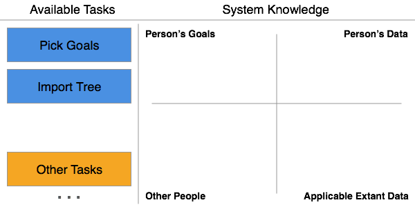
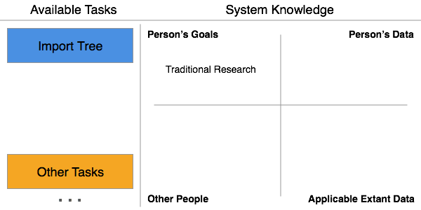
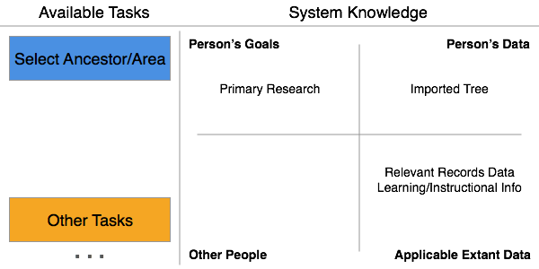
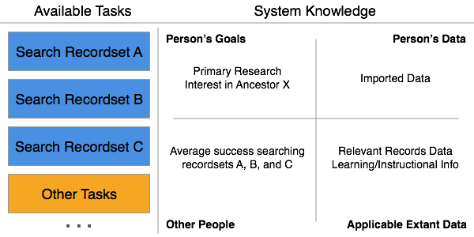
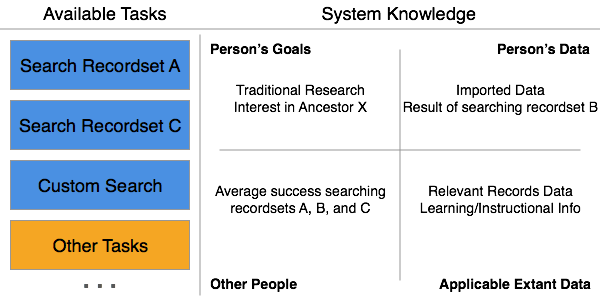

## Diving into Details

Earlier we presented a simplified view of the continuous cycle that powers Anticipatory Genealogy. It is now time to take a closer look at how this works.

The core of Anticipatory Genealogy is built on the interplay between two major concepts: Discrete Actionable Tasks and Results Integration.

A Person is presented with a list of Discrete Actionable Tasks. In the beginning these may be more interrogative in nature, like asking the Person what they are interested in doing, or requesting basic profile information. Then, after each Task is completed, the result of that Task is integrated into what the system knows about the Person. With each Task that is integrated, the available Tasks become more specific to the Person, suggesting Tasks like research guidance, history lessons, or logic puzzles.

First, let's look at Discrete Actionable Tasks in more depth...

### Discrete Actionable Tasks

Discrete Actionable Tasks are exactly what they sound like. A Task is a piece of work to be done or undertaken, and in this case is specific to furthering a Person's genealogy goals. Each Task is discrete, meaning individually separate and distinct. Each task is bounded and well defined, and there is a clear and obvious end result. Each Task is also actionable, meaning that the Task is able to be done or acted on; having practical value. What needs to be done to complete the task is obvious and possible given the current state of the system, and that action has an actual value to the system and the person.

Tasks may be created in one of three ways: through results integration, by the completion of another task, or by the explicit request of the Person. The creation of tasks by results integration will be covered in the next section. The creation of a task via the completion of another task is best explained by example. Say that you are looking for evidence of a Birth. The System knows that there are two record sets to search, A and B, but you should only search B if A has no results. So a Task to search B would be created on the completion of the Task to search record set A results in the birth not being found. The creation of a Task by explicit Person request is like when a Person manually adds a task to a research Log. These tasks are still added to and integrated into the system, but they were not generated by the system.

**A Note about ambiguous Tasks**

One of the most annoying types of tasks to get is "Do X" with no specific guidelines as to how to complete the task. Example is find x person with no specific how-tos. This type of task is specifically disallowed by definition, as it is not actionable. There is no specific instruction that the Person can complete to satisfy this task. A grouping of tasks may have this overall goal, but don't make this a task please :)

**The lifecycle of a Task is as follows:**

1. The Task is created.
2. The Task is made available to the Person.
3. The Task is completed.
4. The Task's result is integrated into the system.

**Task Components: A Task must contain at least the following:**

* Description of the task
* State of the task (Done/Not Done)
* Result of the task

**A Note About State**

Note no intermediate state/working. That is not allowed. Done or not. "In progress" is not handled by this system, but can be inferred by looking at a task series/tree as a whole. NOT in individual tasks.

**Task Organization**

May times it is useful to organize tasks into series, lists, trees, or other groupings to provide tracking details and other analysis capabilities.

The actual grouping is taken into account by the results integration step and will generate new tasks based off of the rules of the grouping. Discuss this more in Results Integration.

* Series - Steps that must be completed in order
* Tree - Mutually Exclusive Tasks based on previous choices
* List - Steps to be completed in any order
* Group - Mash-up of above stuffs?

**Types of Tasks**

* Research Tasks
* Reading/Learning about Ancestor Tasks
* Learning how to do Genealogy Tasks
* Puzzle Tasks
* Direct Query Tasks (teach the System what you want, IE I want to do research on X line)

**Task Rejection**

There is an important case to consider when thinking about task completion: rejection. What happens when a Person actively rejects a task. When they tell us that they have no interest in completing that particular task and dismiss it. This counts as a task completion and the state of the task is complete, but the result of the task is that the Person rejected it. This information is taken into account by the Results Integration step to suggest (or not) additional tasks for the Person to perform.

### Results Integration

The other major component of Anticipatory Genealogy is Results Integration. Again, fairly straightforward when you say it. It means that every task that has been completed is taken into account when providing additional tasks for the person to complete. But this information is not enough by itself. It must be combined with two other sources of information, tasks completed by other people and data/information available to the person.

**Knowledge of Person's Goals**

Information about the person is primarily obtained by the completion of Tasks. Some of these tasks may be direct queries, like are you interested in learning about history in the context of your genealogy. Others are derived from tasks that have been completed already, such as they completed the research on ancestor X from country Y, and there is some additional work to do for another ancestor in the same country. All of the completed and outstanding tasks are saved and taken into account when surfacing new tasks. 

**Knowledge of Person's Data**

This is the Person's genealogical data. It contains their family tree, sources, notes, research logs, and any other information entered by the Person that is used in a genealogical process. This may be data contained within the system or data that resides outside. This information is taken into account to add context to history or to search for tasks to complete that further the Person's goals in researching and/or expanding their tree.

**Knowledge of Other People**

The system takes into account what others have done in similar circumstances to provide accurate and useful tasks to the person. Knowing that people who like X also enjoy completing y is relevant and useful. This information can be obtained by examining other Person's task lists using machine learning and other techniques. It can also be used to suggest collaboration opportunities and other interest overlaps to the person.

**Knowledge of Extant Data**

This is a knowledge of what data exists that can be leveraged and utilized both by and on behalf of the Person. It includes things like what records are extant for a particular location and time, what data is available to explain events, times, and historical contexts to people, etc. It is the knowledge of information that can be shown to the Person or searched by the Person to further their goals.

**Process of Results Integration**

Just knowing about people and data does us no good unless we analyze that knowledge, draw conclusions and inferences, and use that information to benefit the Person. So we take the information we have and generate a set of Tasks that we feel best suites the Person at this time. We look at what we know about the Person, what other Persons like him/her have done, and the data that is available to use and present the Person with the set of tasks we think they would like best.

### Anticipatory Genealogy

Now that we know a bit more about the two main concepts of Anticipatory Genealogy, lets look at some examples of how Discrete Actionable Tasks and Results Integration work together to help people.

#### Traditional Research

Lets see how Anticipatory Genealogy works for Sally, who wants to do research and expand her tree.

**1 - Initial State**

The first thing Sally is presented with is two tasks. The first, Pick Goals, is intended to get an initial sense of what she would like to get out of her genealogy experience. It could ask questions like "How experienced of a researcher are you?", "Do you want help expanding your tree?", or "How much time would you like to spend working on your genealogy per week?". These questions are not limited to the first time she logs in either. When new features come online or the system becomes aware of activities or data that may interest Sue, it can always ask her. The second task, Import Tree, is just what it sounds like.

**2 - Sally selects overall goals**

So after an initial round of questions, the system now knows that Sally is interested in doing traditional research and is fairly experienced. It can't yet recommend or ask about research opportunities because it doesn't know about any of Sally's tree or research data.

**3 - Sally imports her tree**

Now that Sally has imported her tree, the system starts analyzing her data and asks where she would like to focus her research. It uses what it knows about her tree and cross-matches what she is missing with resources that can help her find relevant information. The system informs Sally about the availability of records and learning/instructional information on the various areas it suggests working on. It suggests several ancestors to focus on, but also allows Sally to pick and area of her tree to focus on. After all, this is Sally's journey, and the system needs to adapt to her needs and wants.

**4 - Sally picks an area to research**

Now that Sally has picked an area of her tree to focus on (Ancestor X), it cross-references all of the available record sets and other data with the likelihood that they will be helpful by looking at what other people have found and done. This is then distilled into a set of Tasks that Sally can complete to help her expand her tree. This may be presented to her as a research log, allowing her to complete each search and record the results of that search in the Task.

**5 - Sally starts researching**

Sally is now researching, using the Tasks as a to-do list or research log. Each search is recorded (Record Set B), and the results of the search are integrated into the suggestions for Sally and for other researchers that may try and search that record set. Once Sally finds and enters the applicable information expanding her tree, the system may recommend that she continue searching for additional proof, or may recommend that she stop based on the types of records available. It is also important to note that Sally can add Tasks to remind her to search additional locations (Custom Search), which are treated the same way as system recommended searches.

**In Summary**

After informing the system that she wanted to do some traditional research and importing her tree, Sally was guided through the research process. This guidance was based off of who Sally wanted to focus on, Sally's experience level, what information and records were available, and what records were most helpful to other researchers. The system adapted and tailored an experience for Sally as a person, and presented that experience as a set of personalized Tasks for her to complete. She determined what she wanted, and the system adapted itself to her wants.  

#### Collaboration??

#### Learning About Research

#### Person-Place Puzzles

#### Ancestors in History

### Machine Learning, Rules, lists, etc

Let's examine how a few common techniques can be applied to Anticipatory Genealogy

**Machine Learning**

Having software that learns from and takes into account prior decisions when suggesting Tasks to perform is extremely useful in Anticipatory Genealogy.

Machine Learning is when software learns from and makes decisions based on data, and can be applied to several areas of Anticipatory Genealogy. The most obvious application is the prediction of areas of a Persons interest based on the prior behavior and preferences of other People. Each Task that is completed by a Person is taken into account by the machine learning model, which predicts which users will prefer which new tasks.

An example: 

**Rules Based Programming**
